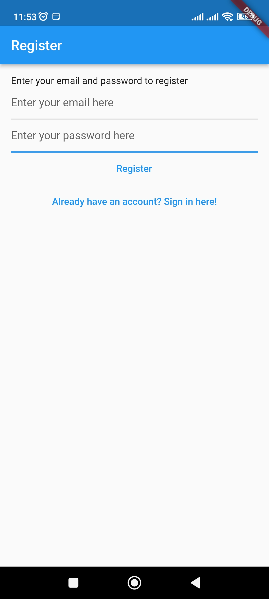

# Notes mini project in Flutter

A mobile notes application built in Flutter
## Technologies

- Flutter

- Dart

- Firebase

- Bloc

## Screenshots

### SplashScreen

### Register

### Login

### Add Note

### Notes

### Share

